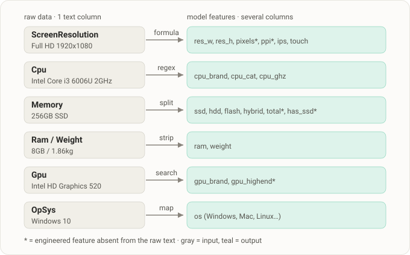
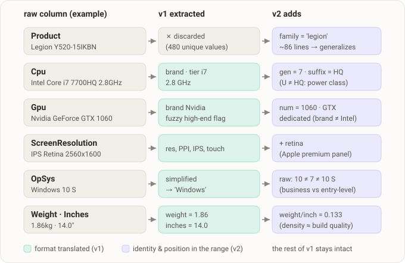

# 💻 Laptop Price Prediction · Kaggle *Data on the Top*

🌐 **English** · [Español](README_ES-ES.md)

> A Machine Learning model that estimates a laptop's price (€) from its technical
> specifications. The heart of the project is **feature engineering** on raw-text data and a
> rigorous model comparison, from a linear baseline to a **gradient-boosting blend**
> (XGBoost · LightGBM · CatBoost).


---

## 🎯 The problem

A laptop store needs to **set prices automatically and objectively**: given a machine with
certain specs (CPU, RAM, display, storage…), what is its fair market price? It's the same
engine behind price-comparison sites, second-hand valuation tools, or mispriced-product
detection systems.

In Machine Learning terms, this is a **supervised regression** problem:

| | |
|---|---|
| **Target** | `Price_in_euros` (continuous variable) |
| **Data** | ~1,300 laptops → **912** train (with price) + **391** test (to predict) |
| **Metric** | **RMSE** in euros — *lower is better* |

$$RMSE = \sqrt{\frac{1}{n}\sum_{i=1}^{n}(y_i - \hat{y}_i)^2}$$

> 🔗 Competition: [Kaggle · Data on the Top](https://www.kaggle.com/competitions/data-on-the-top)

---

## 🧩 The real challenge: feature engineering

The difficulty isn't the algorithm — it's that **the information arrives as raw, messy text**.
A model can't learn from `"128GB SSD + 1TB HDD"`; it *can* learn from "256 GB of SSD and
1000 GB of HDD". On top of that, the single most predictive feature —**pixel density (PPI)**—
doesn't even exist in the data: it has to be *computed*.

| Original column | Comes as… | Transformed into… |
|---|---|---|
| `Ram` | `"8GB"` | `8` |
| `Weight` | `"1.86kg"` | `1.86` |
| `ScreenResolution` | `"IPS Panel Full HD / Touchscreen 1920x1080"` | resolution, **PPI**, touchscreen / IPS flags |
| `Cpu` | `"Intel Core i7 6700HQ 2.6GHz"` | brand, GHz, tier (i3/i5/i7…) |
| `Memory` | `"128GB SSD + 1TB HDD"` | GB of SSD / HDD / Flash / Hybrid + total |
| `Gpu` | `"Nvidia GeForce GTX 1050 Ti"` | brand + high-end flag |
| `OpSys` | `"Windows 10 S"` | simplified OS family |

`Product` (480 unique values) is dropped due to excessive cardinality.

<p align="center">
  
</p>

---

## 🔬 Methodology

Three **self-contained** notebooks that share the *exact* same feature engineering and differ
only in the model. This keeps the comparison fair and tells a clear story: *from simple to
powerful*.

1. **Leakage-free pipeline.** Text parsing is row-wise (no `.fit`), and scaling +
   `OneHotEncoder` live inside a scikit-learn `Pipeline` fitted **only on the training data**.
   The same processing is replicated on `test.csv` via `.transform()`.
2. **Honest validation.** RMSE estimated by **5-fold cross-validation** in euros, not a single
   split.
3. **Final retraining** on 100% of `train.csv` before predicting.

---

## 📈 Results

RMSE in euros. **CV** is the honest estimate (5-fold cross-validation on the full `train.csv`,
printed by each notebook); **leaderboard** is the real Kaggle score on the hidden labels:

| Notebook | Model | RMSE CV (€) | Leaderboard (€) | Role |
|---|---|:---:|:---:|---|
| `01_submission_baseline` | Linear Regression (+ `log1p`) | ~355 | 356.63 | Interpretable baseline |
| `02_submission_rf_svr` | **Random Forest** (+ SVR) | ~280 | 313.16 | Classic ensemble models |
| `03_submission_xgboost` | **XGBoost** | ~257 | 308.62 | Best single model |
| `04_submission_blend` | **Blend** XGB+LGBM+CatBoost+Ridge (NNLS) 🏆 | **~218** | **233.85** | Competition mode |

> From baseline to blend: **−€123 real RMSE (−34%)**, and **−€75 (−24%)** over the best single model.

The biggest jump comes from **v1 → v2** feature engineering: rescuing `Product` as a *family*,
CPU generation, GPU model number… Here is what v2 adds over v1, column by column:

<p align="center">
  
</p>

The gap between CV and the leaderboard **measures memorization**: the baseline (which can't
memorize) nailed its estimate (+€1.4), whereas XGBoost v1 paid +€51 because part of its edge was
memorizing spec combinations. v2 feature engineering turns that memorization into **portable
signal** (`family`, `cpu_gen`…) and cuts the toll to just +€16.

---

## 💡 Key technical decisions

- **Feature engineering is where the points are won**, not the algorithm. PPI and the
  storage-by-type breakdown are the most influential features.
- **The `log` nuance**: log-transforming the target **helps** linear models and SVR (price is
  right-skewed). For boosting, however, the two validation lenses (CV and holdout) disagree by
  €3–5 — within fold noise — so XGBoost trains on the raw price for simplicity. *(The
  project's most subtle detail.)*
- **Validation without self-deception**: a hyperparameter search's best score is the best of N
  candidates on the same folds and is optimistically biased (*winner's curse*). Every "winner"
  gets re-validated on an untouched holdout: in notebook 03 the search winner did **not** beat
  the base config → the final submission ships the base config.
- **No over-engineering (in the main deliverable)**: with v1 features, a 1:1 *blend* didn't beat
  single XGBoost (notebook 03) → ties go to the **simple, defensible** solution. Notebook 04
  shows the flip side: when a blend genuinely pays off.
- **Competition mode (notebook 04)**: `Product` is rescued as a product *family* (~86 lines —
  the signal notebooks 1–3 threw away), plus fine CPU/GPU detail, and a 4-model blend with
  **NNLS weights** fitted on OOF from some fold seeds and **validated on virgin seeds** →
  ~€218 (an extra −15% over the best single model).

---

## 🗂️ Project structure

```
TC_04_Sprint_12_Kaggle/
├── data/                          # train.csv · test.csv · sample_submission.csv
├── assets/                        # README SVG diagrams (es / en)
├── 01_submission_baseline.ipynb   # Linear Regression
├── 02_submission_rf_svr.ipynb     # Random Forest + SVR
├── 03_submission_xgboost.ipynb    # XGBoost
├── 04_submission_blend.ipynb      # Blend (competition mode)
├── submission_01_baseline.csv
├── submission_02_randomforest.csv
├── submission_03_xgboostv2.csv    # (NB3's checker writes it as submission_03_xgboost.csv)
├── submission_04_blend.csv
└── README.md · README_ES-ES.md · README_EN-EN.md
```

---

## 🚀 How to reproduce

```bash
# 1) Install dependencies
pip install numpy pandas scikit-learn xgboost lightgbm catboost matplotlib seaborn jupyter

# 2) Open and run any notebook end-to-end.
#    Each one regenerates its own submission_XX_*.csv, ready for Kaggle.
#    (04 takes ~40-50 min: its CatBoost trains ~90 models.)
jupyter notebook 03_submission_xgboost.ipynb
```

> CSVs are read with `encoding='latin-1'` (some GPU names include special characters).

---

## 🛠️ Stack

`Python` · `pandas` · `NumPy` · `scikit-learn` · `XGBoost` · `LightGBM` · `CatBoost` · `Matplotlib` · `seaborn`

**Skills demonstrated:** cleaning & parsing of unstructured data · feature engineering ·
reproducible leakage-free pipelines · cross-validation · model comparison & tuning ·
communicating results.

---

## ✍️ Author

**Miguel Coxon** — Data Science Bootcamp
<!-- Customize your links: -->
[GitHub](https://github.com/MCCFern) · LinkedIn · Portfolio

---

<sub>Built as an individual challenge for Sprint 12. Dataset owned by the corresponding Kaggle
competition; used for educational purposes.</sub>
